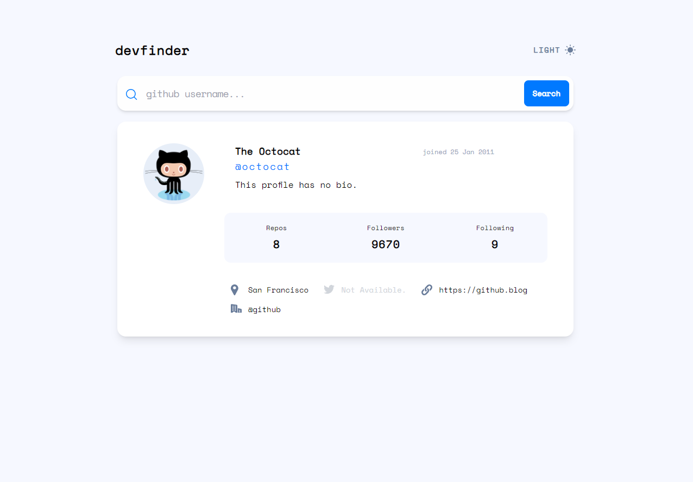

# github-user-search-app

# Frontend Mentor - GitHub user search app solution

This is a solution to the [GitHub user search app challenge on Frontend Mentor](https://www.frontendmentor.io/challenges/github-user-search-app-Q09YOgaH6). Frontend Mentor challenges help you improve your coding skills by building realistic projects.

## Table of contents

- [Overview](#overview)
  - [The challenge](#the-challenge)
  - [Screenshot](#screenshot)
  - [Links](#links)
- [My process](#my-process)
  - [Built with](#built-with)
  - [What I learned](#what-i-learned)
  - [Continued development](#continued-development)
  - [Useful resources](#useful-resources)
- [Author](#author)
- [Acknowledgments](#acknowledgments)

**Note: Delete this note and update the table of contents based on what sections you keep.**

## Overview

### The challenge

Users should be able to:

- View the optimal layout for the app depending on their device's screen size
- See hover states for all interactive elements on the page
- Search for GitHub users by their username
- See relevant user information based on their search
- Switch between light and dark themes
- **Bonus**: Have the correct color scheme chosen for them based on their computer preferences. _Hint_: Research `prefers-color-scheme` in CSS.

### Screenshot

### Links

- Solution URL: [GitHub repository](https://github.com/tomhaakon/github-user-search-app)
- Live Site URL: [Deployed app](https://tomhaakon.github.io/github-user-search-app/)

## My process

### Built with

- Mobile-first workflow

- [Vue 3](https://vuejs.org/) - JS library
- [Pinia](https://pinia.vuejs.org/) - State management
- [DaisyUI](https://daisyui.com/) - Component library for Tailwind CSS
- [tailwindcss](https://tailwindcss.com/) - CSS frameowork
- [VS Code](https://code.visualstudio.com/) + [Volar](https://marketplace.visualstudio.com/items?itemName=Vue.volar) (and disable Vetur) + [TypeScript Vue Plugin (Volar)](https://marketplace.visualstudio.com/items?itemName=Vue.vscode-typescript-vue-plugin).

### What I learned

### Continued development

Use this section to outline areas that you want to continue focusing on in future projects. These could be concepts you're still not completely comfortable with or techniques you found useful that you want to refine and perfect.

### Useful resources

- [ChatGPT](https://chat.openai.com) - Helped me alot when I got stuck. Finding mistakes and just helping me remember basic syntax.

## Author

- Website - [Tom-Håkon Fjeldheim](https://www.your-site.com)
- Frontend Mentor - [@tomhaakon](https://www.frontendmentor.io/profile/tomhaakon)
- Twitter - [@yourusername](https://www.twitter.com/tomhfjeld)

## Acknowledgments

This is where you can give a hat tip to anyone who helped you out on this project. Perhaps you worked in a team or got some inspiration from someone else's solution. This is the perfect place to give them some credit.

## Recommended IDE Setup
